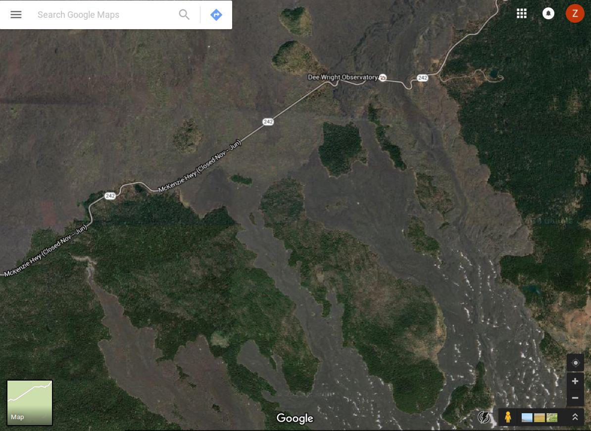

```{r, echo =FALSE}
library(knitcitations)
```

# Ideas for paper topics

## Interactions between plant genotypes, microbiome, and enviroment

Do plants and there microbiomes constitute a "superorganism" (Clements) or an opportunistic set of individualistic species (Gleason)?
The effect of Arabidopsis genotype on microbiome was tested by `r citep("10.1038/nature11237")` and they found some relatively weak associations between genotype and some bacteria.
I expect that taxonomic associations of eukaryotes will be stronger than bacteria due to less horizontal gene transfer. 
Also, Arabidopsis cultivars do not have a natural history.

It would be interesting to compare the rhizobiomes, relatedness, and habitats of a recent plant radiation.


## Island biogeography of soil organisms

Something similar to this `r citep("10.1111/j.1461-0248.2007.01035.x")` except using metagenomics and "islands" of trees surrounded by lava flows near belknap crater. 



The lava flows happened 1500-3000 years ago and there is little regrowth between the islands separated by the younger flows. 

Hmm, looks like something very similar has been done by `r citep("10.1002/ecy.1472")`.
I could focus on more than just fungi.
Also, belknap would be a temperate instead of tropical setting and the flows are much older. 


## Seed metagenomics 

Are seeds, particularly seeds that can travel far, taking their symbionts with them? 

`r citep("10.1111/1758-2229.12181")` review studies on bacterial seed endophytes and concludes that they are ubiquitous and need more study. 

If plants have adapted to transport symbionts/comensals with them, then I expect that plants with greater dispersal distance and ability to colonize new habitats will have a more extensive and regulated seed microbiome.

This could be tested in an observational study of various wild plants with varying dispersal distances.

A possible experimental design would be to take maple semaras, break them in half, sequence the microbiome of one half, plant the other, and sequence the microbiome of the seedling after a few years and compare it to the growth medium community composition. 


## 3D spatial distribtuion of soil community diversity

Something like `r citep("10.1371/journal.pone.0087217")` except using metagenomics.

`r citep("10.1016/0016-7061(88)90031-6")` shows a way to make thin sections down to 30uM using Carbowax 4000.
I wonder if this is possible with liquid N, although it would have to be cut cold.

I would like to test three soil blocks in the same ecoregion: 

* conventional farm soil
* non-till organic farm
* natural prairie


## Minimal plant microbiome for disease supression

It is difficult to distinguish the effect of small groups of interacting organisms in the rhizsphere due to the complexity of the system. 
Small successful combinations of symbionts could be perhaps be found by taking a plant and its soil from a natural habitat, the plant tissue cultured to produce axenic clones, the soil/rhizosphere homogenized gently and diluted to varying degrees, and the clones  planted in sterile soil inoculated with highly diluted soil from original plant. 
The plants that do the best can have their microbiomes sequenced to determine the minimal combinations of microbes needed for vigorous growth. 
there could also be a pathogen added to half to test disease suppression.


## Watershed metagenomics to characterize terrestial and aquatic communities

DNA filtered from water can be used to detect metazoa, but I wonder if it can be used to detect major components of terrestrial organisms in that watershed. 

At what scale is this possible, if any? 
can this be used to monitor pathogens, particularly oomycetes?

This study `citep("10.1101/020800")` proposes this idea that rivers can be used for biodiversity monitoring and tested Eukaryota diversity found in filtered river water.
However, they did not test what species were present in the watershed.

A possible study design would be to characterize the plant, animal, and soil communities of the smallest watershed size that still produces a perennial stream and see what fraction can be detected in the river. 

Another design could be to test river coming out of watershed that have known pathogen outbreaks and see if I can detect the pathogen. 
This would work well for oomycetes such as phytophtora ramoum.


## bibliography

```{r, results='asis', echo = FALSE}
bibliography()
```

